# FraudGraph — Financial Fraud Detection with Graph ML

A full-stack fraud detection and investigation system. It combines a rule engine,
transaction-network analysis, machine learning and graph neural networks to find
suspicious transactions, high-risk accounts and organised **fraud rings**, then gives
analysts the tools to triage alerts, open cases and export reports.

- **Live demo:** [fraud-detection-graphml.vercel.app](https://fraud-detection-graphml.vercel.app)
  (frontend on Vercel, API on Render's free tier — the first request after a quiet
  spell can take about a minute while the backend wakes up)
- **Backend:** FastAPI · SQLAlchemy · SQLite · NetworkX · scikit-learn · XGBoost · PyTorch Geometric
- **Frontend:** React 18 · Vite · Material UI · Recharts · react-force-graph
- **Data:** a synthetic banking dataset with planted fraud (5,000 accounts, 80,000
  transactions), plus the Elliptic Bitcoin dataset as a GNN benchmark

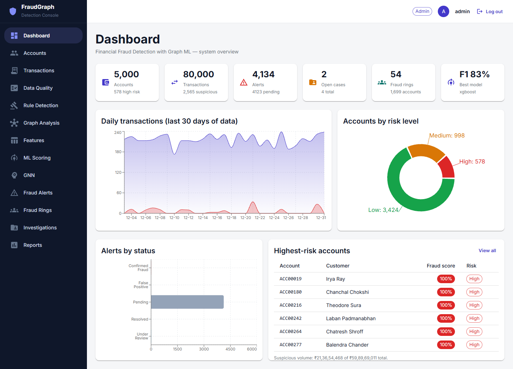

## Contents
- [Key results](#key-results)
- [How it works](#how-it-works)
- [Screenshots](#screenshots)
- [Metrics in detail](#metrics-in-detail)
- [Getting started](#getting-started)
- [Running the pipeline](#running-the-pipeline)
- [Demo scenario](#demo-scenario)
- [Deployment](#deployment)
- [API overview](#api-overview)
- [Project structure](#project-structure)
- [Engineering notes](#engineering-notes)
- [Build progress](#build-progress)

## Key results

Measured on a fresh install seeded with the bundled dataset (`backend/data/raw/`),
running the whole pipeline from the UI on a Windows laptop (CPU only).

| What | Result |
|---|---|
| Rule engine vs. planted fraud | **99.9% precision, 96.2% recall** (2,562 of 2,663 fraud transactions caught, 3 false alarms) |
| Best ML model (XGBoost) | **F1 83.1%, ROC-AUC 94.4%** on a held-out test set of 1,250 accounts |
| GraphSAGE GNN on the account graph | **F1 83.7%, ROC-AUC 95.7%** |
| GraphSAGE GNN on Elliptic Bitcoin (203,769 transactions) | **Accuracy 95.7%, ROC-AUC 90.4%, F1 66.1%** |
| Fraud rings found | **54 rings, 1,699 accounts, 96.8% purity** (members that are real fraud accounts) |
| Full pipeline (rules → graph → features → ML → alerts → rings) | **≈ 22 seconds** |

## How it works

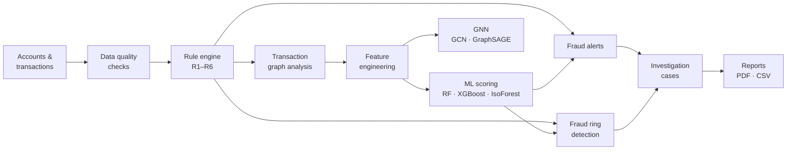

1. **Data quality** — finds missing fields, duplicates, invalid account references,
   amounts and dates, and can clean them (try it with `data/raw/sample_messy.csv`).
2. **Rule engine** — six business rules, no ML. Flagged transactions are marked
   *suspicious* and the accounts involved get a raised risk level (Medium, or High
   when hit by two or more rules).

   | Rule | Flags |
   |---|---|
   | R1 | an amount over ₹1,00,000 |
   | R2 | a sender making more than 5 transactions within 10 minutes |
   | R3 | an account under 30 days old receiving ₹50,000 or more |
   | R4 | fan-in: 8+ distinct senders paying one account within 1 hour |
   | R5 | fan-out: one account paying 8+ distinct receivers within 1 hour |
   | R6 | circular money: A → B → C → A within 48 hours |
3. **Graph analysis** — accounts are nodes and transactions are directed edges
   (aggregated per sender → receiver pair). Each account gets degree centrality,
   PageRank, in/out degree, its Louvain community and whether it sits in a short
   money loop (cycle length ≤ 3).
4. **Feature engineering** — 17 features per account: 11 from its transactions
   (totals, counts, averages, maximums, distinct counterparties, activity rate) and
   6 from the graph.
5. **ML scoring** — Random Forest and XGBoost (both weighted for class imbalance) and
   an unsupervised Isolation Forest. The best model by F1 writes a `fraud_score` to
   every account.
6. **Graph neural networks** — GCN and GraphSAGE node classification, on the
   project's own account graph or on the Elliptic Bitcoin dataset.
7. **Fraud alerts** — one alert per suspicious transaction, plus one per account
   whose ML score passes a threshold (80% by default). Analysts move alerts through
   Pending → Under Review → Confirmed Fraud / False Positive / Resolved.
8. **Fraud rings** — connected groups in the suspicious-activity subgraph. Each ring
   gets roles from its money flow (main account, withdrawal account, sources) and a
   risk rating from the stronger of two signals: the members' average ML score, or
   how many different rules fired on the ring's own transactions.
9. **Investigations** — cases opened from alerts or accounts, with an assignee,
   notes, a status and a final decision.
10. **Reports** — a one-page PDF system summary and CSV exports of suspicious
    transactions, high-risk accounts, alerts and cases.

## Screenshots

All screenshots are from a fresh install running the bundled synthetic dataset.

**Fraud rings** — the detected rings, with an animated money-flow graph of the selected ring

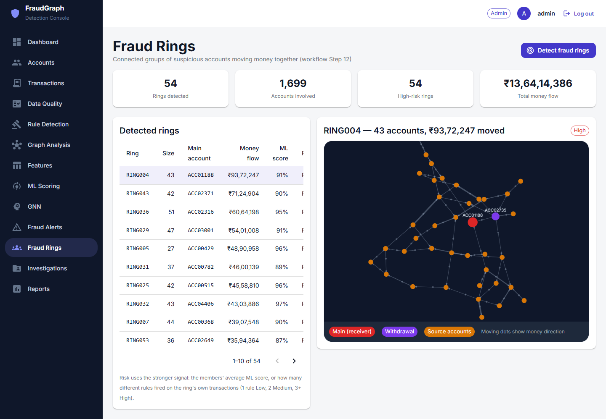

**Rule detection** — hits per rule, risk levels raised, and evaluation against the planted fraud labels

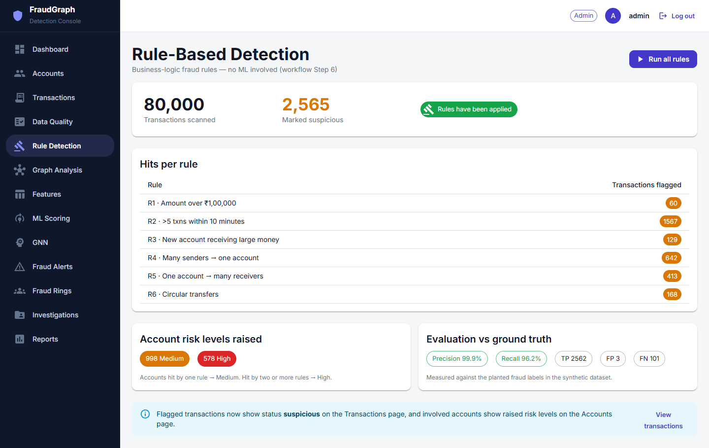

**ML scoring** — model comparison on the held-out test set, feature importances and the highest-risk accounts

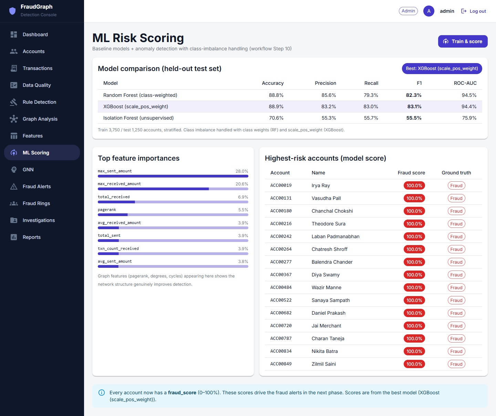

<table>
  <tr>
    <td width="50%"><b>Graph analysis</b> — explore any account's money network<br>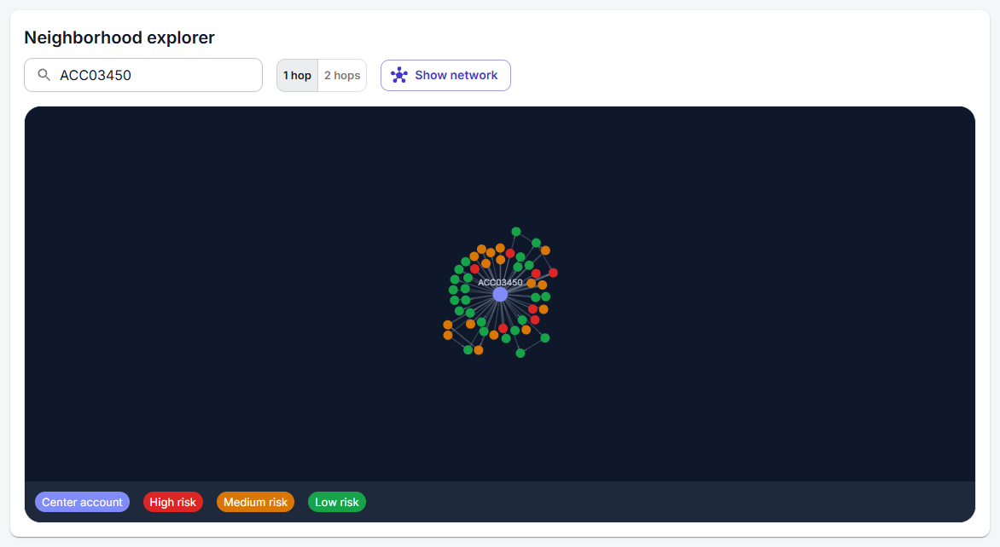</td>
    <td width="50%"><b>Graph neural networks</b> — GCN and GraphSAGE on both datasets<br>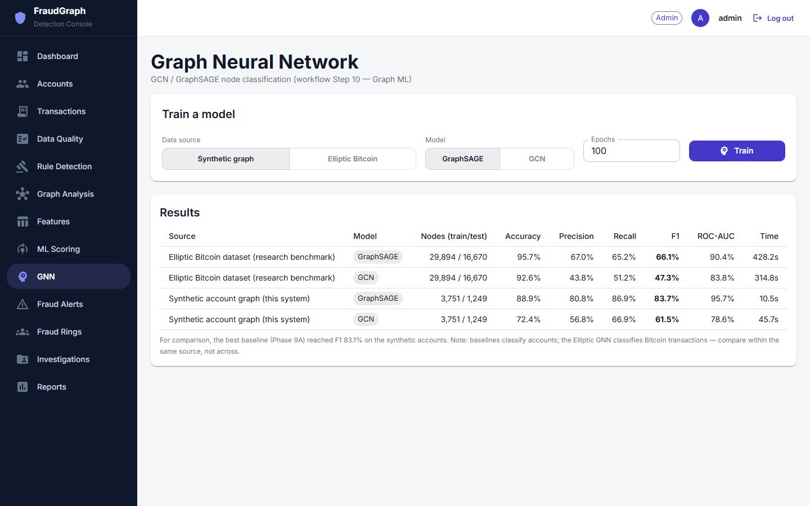</td>
  </tr>
  <tr>
    <td><b>Fraud alerts</b> — rule and ML alerts with a status workflow<br>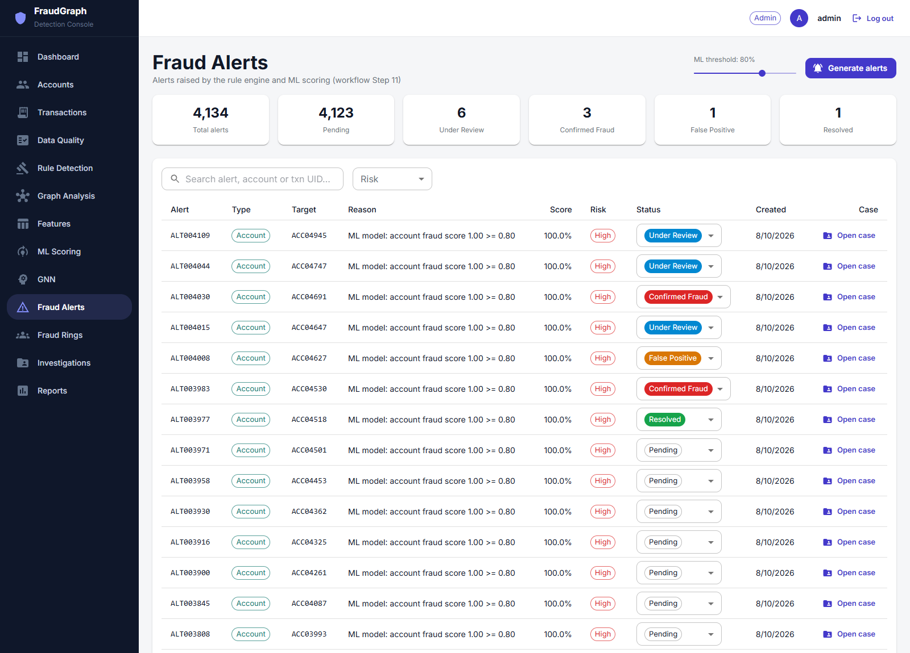</td>
    <td><b>Investigations</b> — case management<br>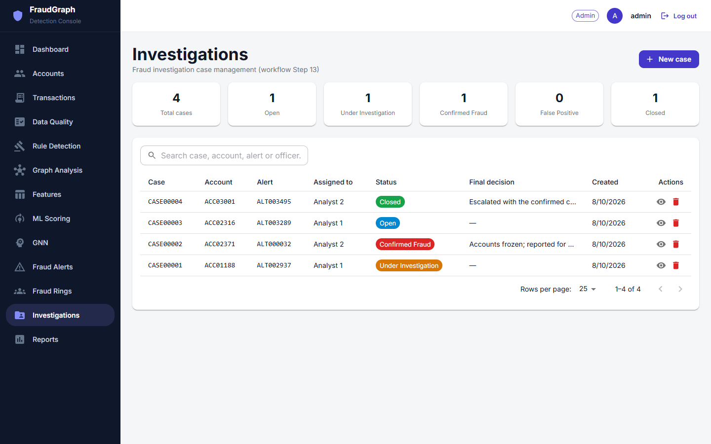</td>
  </tr>
  <tr>
    <td><b>Feature engineering</b> — the 17-feature matrix the models train on<br>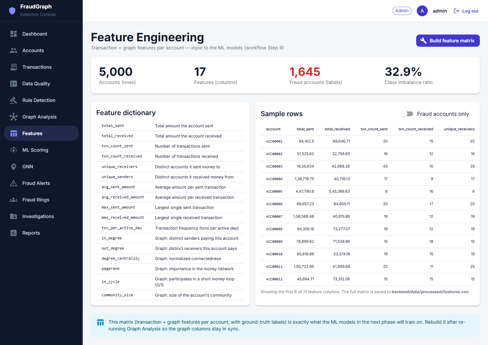</td>
    <td><b>Reports &amp; export</b> — PDF summary and CSV exports<br>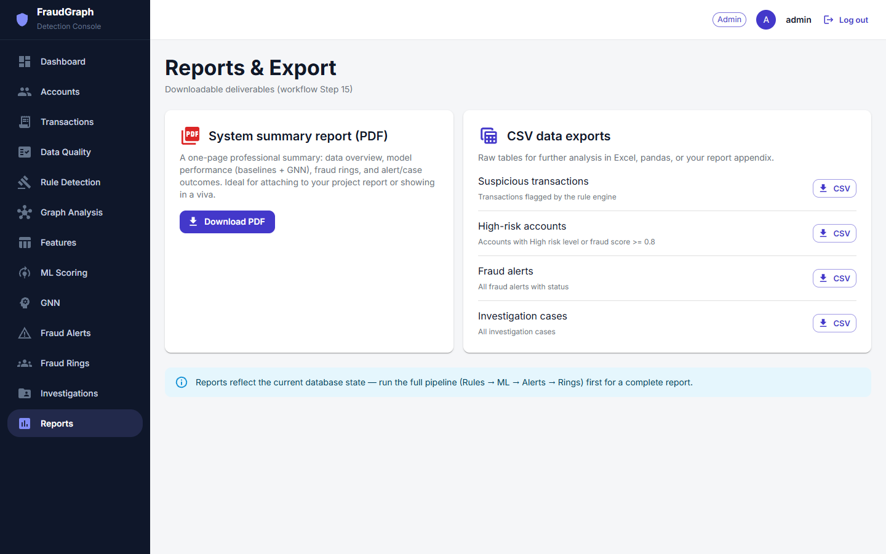</td>
  </tr>
  <tr>
    <td><b>Transactions</b> — search, add, delete and CSV upload<br>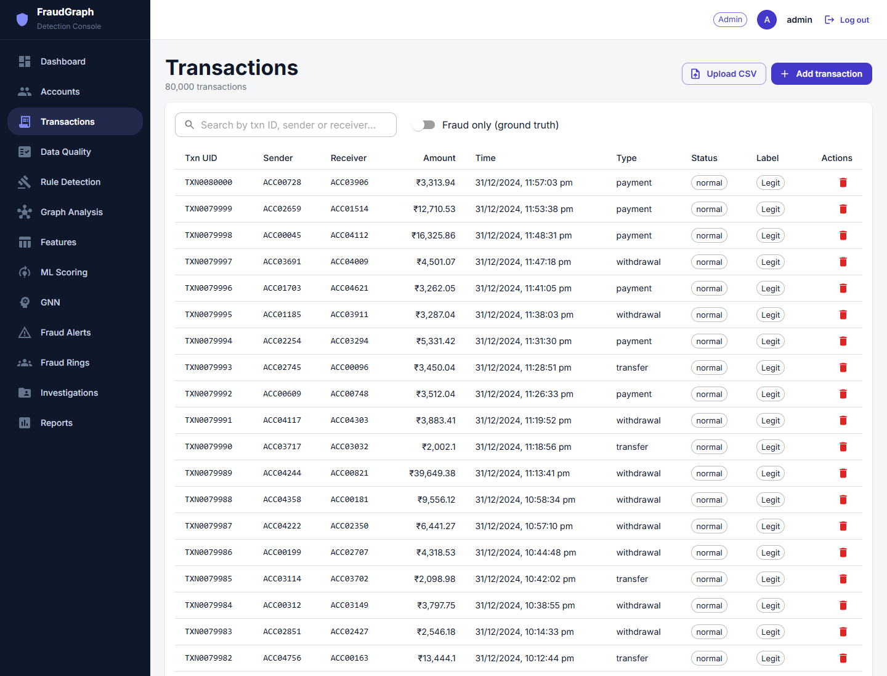</td>
    <td><b>Accounts</b> — search, add, edit and deactivate; risk levels from the rules<br>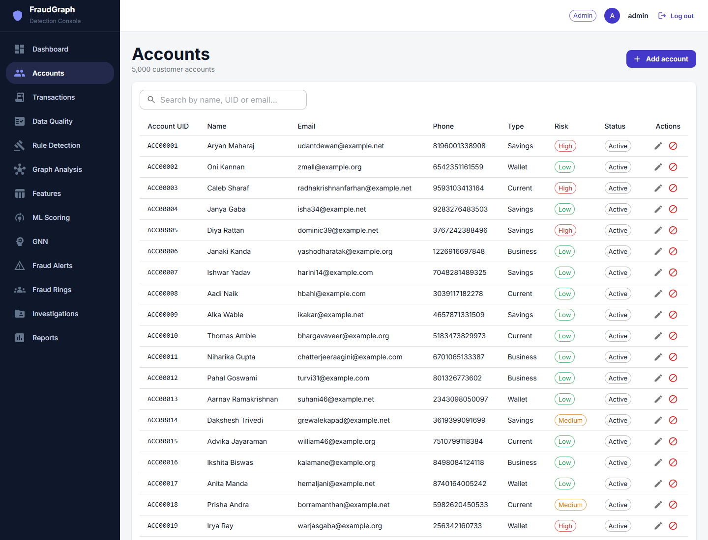</td>
  </tr>
  <tr>
    <td><b>Data quality</b> — preprocessing checks and cleaning<br>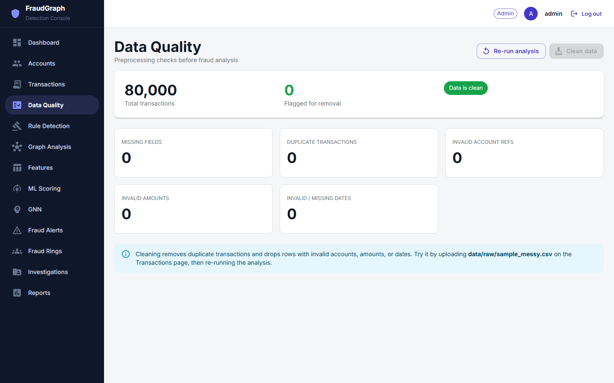</td>
    <td><b>Login</b> — JWT-authenticated admin console<br>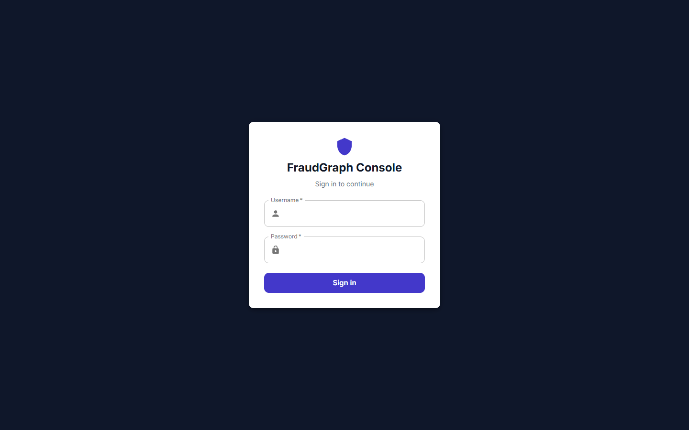</td>
  </tr>
</table>

## Metrics in detail

### Dataset

| | |
|---|---|
| Accounts | 5,000 (1,645 involved in fraud — 32.9%) |
| Transactions | 80,000 over 1 Jan – 31 Dec 2024 |
| Fraudulent transactions | 2,663 (3.3%) — rings, structuring, circular transfers, fan-out, new-account deposits |
| Total money moved | ₹59.9 crore |
| GNN benchmark | Elliptic Bitcoin: 203,769 transactions, 234,355 edges, 165 features |

### Rule engine

| Rule | Transactions flagged |
|---|---:|
| R1 · Amount over ₹1,00,000 | 60 |
| R2 · More than 5 transactions within 10 minutes | 1,567 |
| R3 · New account receiving large money | 129 |
| R4 · Many senders → one account | 642 |
| R5 · One account → many receivers | 413 |
| R6 · Circular transfers | 168 |
| **Flagged in total** (a transaction can hit several rules) | **2,565** |

Against the planted fraud labels: **2,562 true positives, 3 false positives and
101 false negatives**, so **99.9% precision and 96.2% recall**. The rules raised 578
accounts to High risk and 998 to Medium. Suspicious transactions account for
₹21.4 crore of the ₹59.9 crore total.

### Transaction graph

| | |
|---|---|
| Nodes (accounts) | 5,000 |
| Directed edges (sender → receiver pairs) | 78,918 |
| Weakly connected components | 1 |
| Louvain communities | 8 |
| Short money loops (length ≤ 3) | 1,561, involving 2,866 accounts |

### Machine learning (held-out test set)

Stratified 75/25 split: 3,750 accounts to train on, 1,250 to test.

| Model | Accuracy | Precision | Recall | F1 | ROC-AUC |
|---|---:|---:|---:|---:|---:|
| Random Forest (class-weighted) | 88.8% | 85.6% | 79.3% | 82.3% | 94.5% |
| **XGBoost (`scale_pos_weight`)** — best | **88.9%** | **83.2%** | **83.0%** | **83.1%** | **94.4%** |
| Isolation Forest (unsupervised) | 70.6% | 55.3% | 55.7% | 55.5% | 75.9% |

Top XGBoost features: `max_sent_amount` 28.0%, `max_received_amount` 20.6%,
`total_received` 6.9%, `pagerank` 5.5%, `avg_received_amount` 3.9%, `total_sent` 3.9%,
`txn_count_received` 3.9%, `avg_sent_amount` 3.8%. PageRank in fourth place shows that
the network structure adds signal the transaction totals alone don't carry.

### Graph neural networks

Trained locally on CPU (PyTorch Geometric isn't installed on the Render free tier).

| Dataset | Model | Train / test nodes | Accuracy | Precision | Recall | F1 | ROC-AUC | Training time |
|---|---|---:|---:|---:|---:|---:|---:|---:|
| Account graph (5,000 nodes, 17 features) | **GraphSAGE** | 3,751 / 1,249 | 88.9% | 80.8% | 86.9% | **83.7%** | **95.7%** | 10.5 s |
| Account graph | GCN | 3,751 / 1,249 | 72.4% | 56.8% | 66.9% | 61.5% | 78.6% | 45.7 s |
| Elliptic Bitcoin (temporal split) | **GraphSAGE** | 29,894 / 16,670 | **95.7%** | 67.0% | 65.2% | **66.1%** | **90.4%** | 428.2 s |
| Elliptic Bitcoin | GCN | 29,894 / 16,670 | 92.6% | 43.8% | 51.2% | 47.3% | 83.8% | 314.8 s |

GraphSAGE beats GCN on both datasets, and on the account graph it edges out the
best tabular model (F1 83.7% vs 83.1%), learning from each account's neighbours as
well as its own features. Elliptic is the harder, realistic benchmark: only ~10% of its labelled
transactions are illicit, and the model is tested on later time steps than it trained on.

### Alerts and fraud rings

| | |
|---|---|
| Alerts generated | 4,134 — 2,565 from rules (one per suspicious transaction) + 1,569 from ML (accounts scoring ≥ 80%) |
| Fraud rings | 54, all rated High risk |
| Accounts in rings | 1,699 (ring sizes 13 – 51) |
| Ring purity | 96.8% of ring members are ground-truth fraud accounts |
| Money moved by rings | ₹13.6 crore |

### Pipeline speed

| Step | Time |
|---|---:|
| Rule detection (80,000 transactions) | 7.8 s |
| Graph analysis | 5.9 s |
| Feature engineering | 1.9 s |
| ML training + scoring (3 models) | 3.8 s |
| Alert generation | 0.8 s |
| Fraud ring detection | 1.8 s |
| **Total** | **≈ 22 s** |

### Codebase

| | |
|---|---|
| Backend | ~3,900 lines of Python in 56 files · 47 REST endpoints · 7 database tables |
| Frontend | ~3,100 lines of React in 38 files · 14 pages |
| ML / graph | 6 rules · 17 features · 3 tabular models · 2 GNN architectures |

## Getting started

You need Python 3.10+ and Node.js 18+.

### Backend
```bash
cd backend
python -m venv venv
# Windows:  venv\Scripts\activate
# Mac/Linux: source venv/bin/activate
pip install -r requirements.txt
cp .env.example .env            # local settings (APP_ENV=development)
python -m scripts.init_db       # creates the tables and the admin user
python -m scripts.seed_data     # loads data/raw/: 5,000 accounts, 80,000 transactions
uvicorn app.main:app --reload   # http://127.0.0.1:8000 (API docs at /docs)
```

The dataset in `data/raw/` is generated with a fixed seed. To regenerate it, run
`python -m data.generate_synthetic`, then `seed_data` again on a fresh database.

### Frontend (in a second terminal)
```bash
cd frontend
npm install
cp .env.example .env            # VITE_API_URL points to the backend
npm run dev                     # http://localhost:5173
```

Open http://localhost:5173 and log in with **admin / admin123**. That default only
works locally, where `.env` sets `APP_ENV=development`; anywhere else the backend
refuses to start with placeholder or weak secrets (see [Deployment](#deployment)).

### Graph neural networks (optional)
The GNN page needs PyTorch and PyTorch Geometric, kept separate because they are large:
```bash
cd backend
pip install -r requirements-gnn.txt   # ~200 MB+, CPU-only is fine
```
Restart the backend. On the GNN page:
- **Synthetic graph** trains in seconds on the account network (run Graph Analysis
  and Features first).
- **Elliptic Bitcoin** downloads ~500 MB into `backend/data/elliptic` on first use;
  training on ~200k nodes takes several minutes on CPU.

## Running the pipeline

The database starts with raw accounts and transactions only. Run the detection
steps from the sidebar, in this order:

**Rule Detection → Graph Analysis → Features → ML Scoring → Fraud Alerts → Fraud Rings**

Data Quality can run at any time, and GNN after Features. Then triage alerts on
Fraud Alerts, open cases on Investigations, and download the PDF summary or CSV
exports from Reports.

## Demo scenario

A scripted mule-network laundering operation for live demos. All its ids start with
`DEMO-`, and the story triggers every rule R1–R6:

1. **Collection** — 9 feeder accounts pay a mule account opened 6 days earlier, all within 25 minutes (R4, R3)
2. **Consolidation** — the mule forwards everything to a collector (R1)
3. **Layering** — collector → shell 1 → shell 2 → collector, each hop under ₹1,00,000 (R6)
4. **Cash-out** — 9 transfers just under ₹1,00,000 to 9 cash-out accounts in 8 minutes (R2, R5)

```bash
cd backend
python -m scripts.demo_scenario               # plant it, run the whole pipeline, print what caught each stage
python -m scripts.demo_scenario --plant-only  # plant it, then click through the pipeline in the UI
python -m scripts.demo_scenario --serve       # run the backend on the demo copy, to show it in the UI
python -m scripts.demo_scenario --cleanup     # delete the demo copy
```

Sample output (abridged):
```
Rule engine - did each stage get caught?
  1 Collection     flagged 9/9   R3 · New account receiving large money x8, R4 · Many senders → one account x9
  2 Consolidation  flagged 1/1   R1 · Amount over ₹1,00,000 x1
  3 Layering       flagged 3/3   R6 · Circular transfers x3
  4 Cash-out       flagged 9/9   R2 · >5 txns within 10 minutes x9, R5 · One account → many receivers x9

Fraud rings containing demo accounts:
  RING034: 51 accounts, main DEMO-COLLECTOR, withdrawal DEMO-CASH01, Rs 3,266,060 moved, risk High (ML score 0.63)
    rules fired on its transactions: R1, R2, R3, R4, R5, R6
```

All 22 scenario transactions are caught, and the ring detector finds the whole
operation with its collector and withdrawal accounts. The demo accounts are planted
as *not* fraud, so the ML model is never told about them, and most get low ML scores.
The rules and the graph catch a new pattern the trained model hasn't seen.

Your own data is never changed: the demo works on a copy of the SQLite database,
`saved_models/` and `features.csv` in `backend/data/demo/`. `--serve` runs the backend
on that copy at port 8000, so stop your normal backend first; the frontend needs no
changes. While it runs, planting again and `--cleanup` refuse to start. Planting again
replaces the demo with a fresh copy of your current data; if that fails or is interrupted,
`--serve` refuses the unfinished copy until you plant again.

## Deployment

The backend runs on **Render** (free tier, `render.yaml` Blueprint) and the frontend
on **Vercel**; both redeploy automatically on every push to `main`. See
[DEPLOYMENT.md](DEPLOYMENT.md) for the step-by-step setup.

- **Fails closed:** unless `APP_ENV=development`, the backend refuses to start with
  a missing, placeholder or weak `SECRET_KEY` (32+ characters) or `ADMIN_PASSWORD`
  (12+ characters, not `admin123`), and never prints secret values.
- **Self-seeding:** Render's disk resets on redeploys, so the start script reseeds
  the dataset whenever the database is empty.
- **CORS:** allowed origins are normalised, so a URL pasted from the address bar
  (with a path, trailing slash or capitals) still matches.
- **SPA routing:** `frontend/vercel.json` serves `index.html` for page paths, so
  refreshing a page like `/rules` works, while missing files under `/assets/` still 404.

## API overview

Every route except `POST /api/auth/login` and the `/` health check needs a JWT
(`Authorization: Bearer <token>`). Interactive docs are at `/docs`.

| Area | Endpoints |
|---|---|
| `/api/auth` | log in, current user |
| `/api/accounts` | list / search, create, view, update, activate, deactivate |
| `/api/transactions` | list / search, create, view, update, delete, CSV upload |
| `/api/preprocessing` | quality report, clean |
| `/api/rules` | run the rule engine, status |
| `/api/graph` | analyze, status, metrics, an account's neighbourhood |
| `/api/features` | build the matrix, status, preview |
| `/api/ml` | train & score, results, top-risk accounts |
| `/api/gnn` | train, results |
| `/api/alerts` | generate, summary, list, update status |
| `/api/rings` | detect, summary, ring detail with its graph |
| `/api/cases` | summary, list, view, create, update, delete |
| `/api/dashboard` | system-wide stats |
| `/api/reports` | CSV exports, PDF summary |

## Project structure

```
backend/
  app/
    api/            REST routes (one module per area)
    ml/             rules, graph build + analysis, features, baseline models, GNN,
                    alerts, fraud rings, preprocessing, output-file helpers
    models/         SQLAlchemy tables: accounts, transactions, rule hits,
                    graph metrics, alerts, cases, users
    schemas/        request/response models
    core/           password hashing and JWTs
    config.py       settings (.env), production safety checks
  data/
    raw/            the synthetic dataset (CSV) and a messy sample for cleaning
    generate_synthetic.py
  scripts/          init_db, seed_data, render_start.sh, demo scenario
frontend/
  src/
    pages/          one page per pipeline step (14)
    api/            API client per area
    components/     layout, risk chips, dialogs, route guard
    context/        login state
docs/screenshots/   the images in this README
render.yaml         Render Blueprint
DEPLOYMENT.md       deployment guide
```

## Engineering notes

- **Fast rules.** Fan-in and fan-out keep a running count of counterparties as the
  time window slides, instead of recounting the window for every transaction (the
  rules went from 26.9 s to 4.6 s on the dev machine, with identical results), and the
  circular-transfer rule prunes candidates by time window with binary search.
- **Rings rated on evidence.** A ring's risk counts the rules that fired on the ring's
  *own* transactions, so a pattern the ML model hasn't learned can still rate High.
- **Safe output files.** Models, results and the feature matrix are written to a
  temporary file and swapped into place, so a page reading them mid-write never
  sees half a file.
- **Isolated demo.** The demo scenario copies the data with SQLite's backup API (read
  only), points the app at the copy before its database engine exists, and holds a
  lock while serving, so it can never touch the real data.

## Build progress
- [x] Phase 1: Backend foundation (database models, admin login)
- [x] Phase 2: React frontend foundation (login, layout, protected routes)
- [x] Phase 3: Synthetic data generator (5,000 accounts, 80,000 transactions, planted fraud)
- [x] Phase 4: Account & transaction management + CSV upload
- [x] Phase 5: Data preprocessing (detect + clean)
- [x] Phase 6: Rule-based fraud detection (6 rules, 96.2% recall, 99.9% precision)
- [x] Phase 7: Graph construction + analysis (centrality, PageRank, communities, cycles)
- [x] Phase 8: Feature engineering (17 transaction + graph features per account)
- [x] Phase 9A: ML scoring — Random Forest / XGBoost / Isolation Forest (XGBoost F1 83.1%)
- [x] Phase 9B: GNN — GCN / GraphSAGE on the account graph + Elliptic benchmark
- [x] Phase 10: Fraud alerts (rule + ML sources, full status workflow)
- [x] Phase 11: Fraud ring detection + visualization (54 rings, 96.8% purity)
- [x] Phase 12: Investigation cases
- [x] Phase 13: Dashboard (stats, charts, top-risk accounts)
- [x] Phase 14: Reports & export (PDF summary, CSV exports)
- [x] Deployment: Render + Vercel, production safety checks
- [x] Demo scenario: scripted mule network on an isolated copy
